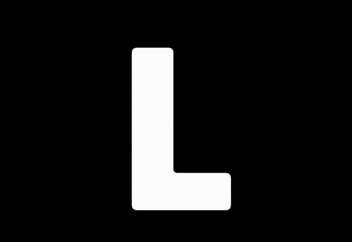

# kinetic-typography-7
실습을 통해 Creative Coding Tutorial을 학습하며 만들어본 일곱번째 프로젝트입니다.

[페이지 바로가기](https://mooyeon-choi.github.io/kinetic-typography-7/)

## About The Project

* 일정 시간이 지나면 글자가 수축하여 다른 글자로 바뀝니다.
* 마우스로 글자를 흐트러뜨릴 수 있습니다.
* 흐트러진 글자는 일정시간이 지나면 원래 모양으로 돌아옵니다.

## Built With

* JavaScript Canvas
* PIXI

## Getting Started

* `index.html` 파일을 실행하여 로컬환경에서 동작 시킬 수 있습니다.
